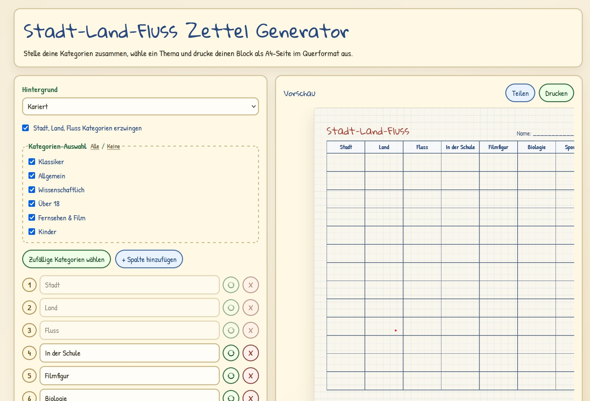

# Stadt-Land-Fluss Zettel Generator

Diese Anwendung ist ein druckbarer Stadt-Land-Fluss-Generator als React Single-Page-App.
Du kannst Kategorien flexibel zusammenstellen, Zufallskategorien nutzen, Themes wählen und direkt eine A4-Vorlage ausdrucken.



Live testen:
https://stadt-land-fluss.app.familie-bark.de/

## Self Hosting (Quick Start)

### Docker Compose

1. Speichere den Inhalt in einer `docker-compose.yml`:

```yaml
services:
  stadt-land-fluss:
    image: beberhardt/stadt-land-fluss:latest
    container_name: stadt-land-fluss
    restart: unless-stopped
    ports:
      - "80:80"
```

2. Starte die Anwendung mit

```bash
docker compose up -d
```

### Docker

```bash
docker run -d --name stadt-land-fluss --restart unless-stopped -p 8080:80 beberhardt/stadt-land-fluss:latest
```

## Developer Information

### Stack

- React 19
- TypeScript
- Vite 7
- Tailwind CSS v4
- ESLint + Prettier
- Vitest + Testing Library

### Lokale Entwicklung

```bash
npm install
npm run dev
```

App lokal:
http://localhost:5174

### Qualität

```bash
npm run lint
npm run lint:fix
npm run format
npm run format:write
npm run test
```

### Build

```bash
npm run build
npm run preview
```

### Dev per Docker

```bash
npm run docker:dev
npm run docker:down
npm run docker:logs
```
